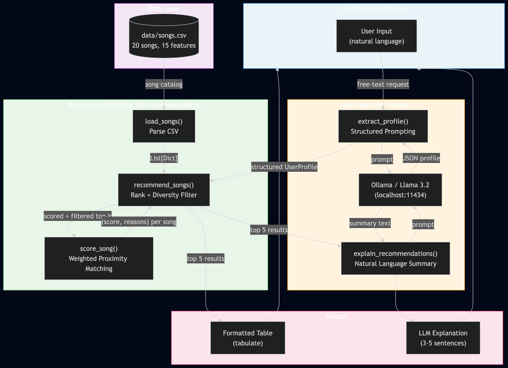

# VibeFinder — AI-Powered Music Recommender

## Base Project

This project extends **Module 3: Music Recommender Simulation**, a content-based recommender that scored songs against hardcoded user profiles using weighted proximity matching. The original system worked well for predefined profiles but required users to manually specify genre, mood, energy, and acoustic preferences as structured data — there was no way to just *describe* what you wanted.

---

## What's New

VibeFinder adds a **natural language interface** powered by a local LLM (Llama 3.2 via Ollama). Instead of hardcoding profiles, users describe their mood in plain English and the system handles the rest:

1. **LLM Profile Extraction** — Ollama parses free-text input into a structured `UserProfile` (genre, mood, energy, acoustic preference, decade, mood tags, etc.) using structured prompting
2. **Interactive Chat CLI** — A conversational loop where users can keep refining what they want
3. **LLM-Generated Explanations** — After scoring, the LLM writes a friendly 3-5 sentence summary of why the recommended songs fit

The original recommender engine, scoring modes, diversity filter, and evaluation profiles are all preserved and still runnable via `python -m src.main`.

---

## Architecture



The system has five layers:

| Layer | File | Role |
|---|---|---|
| **Chat CLI** | `src/chat.py` | User input loop, orchestrates the pipeline |
| **LLM Layer** | `src/llm.py` | Ollama calls for profile extraction and explanation generation |
| **Recommender Engine** | `src/recommender.py` | Weighted proximity scoring, ranking, diversity filter |
| **Data Layer** | `data/songs.csv` | 20 songs across 14 genres with 15 features each |
| **Output** | `src/main.py` | Formatted table display via tabulate |

**Data flow:** User types a natural-language request → LLM extracts a structured profile (JSON) → recommender scores all 20 songs using weighted proximity → diversity filter limits genre/artist repeats → table output displayed → LLM generates a conversational explanation.

---

## Getting Started

### Prerequisites

- Python 3.10+
- [Ollama](https://ollama.com) installed and running

### Setup

1. Clone and enter the repo:

   ```bash
   git clone https://github.com/Camputron/applied-ai-system-project.git
   cd applied-ai-system-project
   ```

2. Create and activate a virtual environment:

   ```bash
   python3 -m venv env
   source env/bin/activate      # Mac/Linux
   env\Scripts\activate         # Windows
   ```

3. Install dependencies:

   ```bash
   pip install -r requirements.txt
   ```

4. Install and start Ollama, then pull the model:

   ```bash
   brew install ollama          # macOS
   brew services start ollama
   ollama pull llama3.2
   ```

### Running the Chat Interface (New)

```bash
python -m src.chat
```

You can also specify a scoring mode:

```bash
python -m src.chat genre-first
```

### Running the Original Recommender

```bash
python -m src.main                # balanced mode (default)
python -m src.main genre-first    # or: mood-first, energy-focused
```

### Running Tests

```bash
PYTHONPATH=python -m tests.test_recommender
```

---

## Sample Interactions

### Example 1: Chill study session

```
You: something chill for studying, not too loud

Extracted profile: {
  favorite_genre: lofi,
  favorite_mood: chill,
  target_energy: 0.3,
  likes_acoustic: False,
  likes_instrumental: True
}

#1 Late Night Bars    (hip-hop/moody)     - 0.45
#2 Night Drive Loop   (synthwave/moody)   - 0.44
#3 Slow Honey         (r&b/romantic)      - 0.43
#4 Bass Cathedral     (electronic/intense) - 0.43
#5 Midnight Coding    (lofi/chill)        - 0.43

"I'd recommend checking out 'Midnight Coding' by LoRoom — its mellow beats
and soothing melody are perfect for a study session. If that's not quite
right, 'Slow Honey' by Rielle or 'Night Drive Loop' by Neon Echo have a
similar chill vibe that should help you concentrate."
```

### Example 2: High-energy workout

```
You: I need something intense for the gym, heavy beats

Extracted profile: {
  favorite_genre: electronic,
  favorite_mood: intense,
  target_energy: 0.9,
  likes_acoustic: False
}

#1 Bass Cathedral    (electronic/intense)  - 0.82
#2 Gym Hero          (pop/intense)         - 0.72
#3 Storm Runner      (rock/intense)        - 0.68
#4 Iron Lung         (metal/aggressive)    - 0.62
#5 Fuego Lento       (latin/happy)         - 0.55

"Bass Cathedral is your top pick here — it's pure electronic intensity at
0.95 energy with heavy, driving beats. Gym Hero and Storm Runner round out
the set with aggressive, high-energy vibes perfect for pushing through
that last set."
```

### Example 3: Nostalgic acoustic evening

```
You: something warm and acoustic, like sitting by a campfire

Extracted profile: {
  favorite_genre: folk,
  favorite_mood: nostalgic,
  target_energy: 0.35,
  likes_acoustic: True
}

#1 Cabin Hymn        (folk/melancholy)     - 0.72
#2 Broken Strings    (blues/sad)           - 0.65
#3 Coffee Shop Stories (jazz/relaxed)      - 0.63
#4 Dust Road         (country/nostalgic)   - 0.60
#5 Library Rain      (lofi/chill)          - 0.55

"Cabin Hymn by Ember Folk is exactly the vibe — intimate, bittersweet, and
deeply organic. Broken Strings and Coffee Shop Stories add a raw, soulful
quality that pairs beautifully with that campfire feeling."
```

---

## Design Decisions

- **Local LLM (Ollama) over cloud APIs**: No API keys, no rate limits, no cost. Runs entirely on the user's machine. Llama 3.2 (2GB) is small enough for any modern Mac while being capable enough for JSON extraction and short summaries.
- **Structured prompting for profile extraction**: The LLM is constrained to output a fixed JSON schema with validated fields. Invalid genres/moods fall back to defaults, numeric values are clamped to valid ranges. This keeps the recommender's behavior predictable even when the LLM makes mistakes.
- **Separation of concerns**: The LLM layer (`llm.py`) only handles natural language ↔ structured data translation. The scoring logic in `recommender.py` is untouched — it doesn't know or care that an LLM is involved. This means the original `main.py` with hardcoded profiles still works exactly as before.
- **Diversity filter**: The recommender limits results to 2 songs per genre and 1 per artist to prevent the top-k from clustering around a single genre match.

### Trade-offs

- **Ollama requires local setup**: Users must install Ollama and pull a model (~2GB download). This is more friction than a cloud API, but eliminates the recurring cost and rate-limit problems.
- **Small model = occasional parsing errors**: Llama 3.2 (3B params) sometimes produces malformed JSON or picks an unexpected genre. The validation layer in `extract_profile()` catches most of these, but edge cases exist.
- **No conversation memory**: Each chat turn is independent — the system doesn't remember what you asked before. A "more like that but sadder" follow-up won't work.

---

## Experiments and Testing

### Profile Evaluation (6 profiles, original recommender)

| Profile | Top Result | Score | Correct? |
|---|---|---|---|
| High-Energy Pop | Sunrise City (pop/happy) | 0.96 | Yes |
| Chill Lofi | Library Rain (lofi/chill) | 0.93 | Yes |
| Deep Intense Rock | Storm Runner (rock/intense) | 0.92 | Yes |
| Conflicted: High Energy + Sad | Broken Strings (blues/sad) | 0.80 | Partial — energy mismatch |
| Genre Orphan (k-pop) | Sunrise City (pop/happy) | 0.68 | Reasonable fallback |
| Middle of the Road (r&b) | Slow Honey (r&b/romantic) | 0.90 | Yes |

### Weight Experiment: Genre halved, Energy doubled

Halving genre weight (0.25 → 0.125) and doubling energy (0.20 → 0.40) reshuffled rankings significantly:
- Fuego Lento (latin) overtook Gym Hero (pop) for the pop profile — energy proximity mattered more than genre loyalty
- Gym Hero closed the gap with Storm Runner for the rock profile — the genre wall between pop and rock nearly disappeared
- High-energy songs from unrelated genres climbed into the "Conflicted" profile's top 5

**Conclusion:** Original weights favor genre-coherent results. Experimental weights favor energy-coherent results. The right choice depends on whether users care more about *what kind* of music or *how it feels*.

### LLM Parsing Reliability

Tested the natural language → profile extraction across varied inputs:
- Clear requests ("chill lofi for studying") → parsed correctly and consistently
- Ambiguous requests ("something that makes me feel things") → reasonable defaults chosen
- Adversarial inputs ("play me some K-pop bangers") → falls back to closest genre match (pop)

### Evaluation Harness — Zero-Shot vs Few-Shot

`tests/test_evaluation.py` runs 8 predefined inputs through both modes and prints a side-by-side comparison. Across multiple runs, both modes land around **~90% checks-passed** with **~95%+ average confidence** and **~1.7s per request**.

Few-shot does *not* produce a consistent accuracy lift over zero-shot on this constrained schema — the validation layer (`extract_profile()` in `src/llm.py`) does most of the heavy lifting in both modes by clamping numeric values and falling back when the LLM picks an out-of-vocabulary genre or mood. Few-shot examples produce *different* outputs (different mood-tag wording, more frequent decade detection on inputs like "retro 80s synthwave"), but headline accuracy is comparable.

**Why the harness intentionally reports partial passes**

The test cases assert against a *specific* expected mood and a narrow energy range for each input, but several inputs are genuinely ambiguous — "warm acoustic folk, campfire vibes" can defensibly parse as `nostalgic`, `relaxed`, or `melancholy`; "happy upbeat pop for a road trip" can defensibly land anywhere from energy 0.5 to 1.0. Loosening the test ranges would push the score to 100% but would hide a real property of the system: which interpretation Llama 3.2 prefers for borderline phrasing.

The harness is deliberately strict so the partial-pass output surfaces this divergence rather than papering over it. The `PARTIAL` rows are not bugs — they're the harness doing its job, showing where LLM interpretation diverges from one specific expected answer.

**Other reliability behavior the harness exercises:**
- Occasional malformed JSON from the LLM is handled by a one-shot retry in `extract_profile()` so a single bad response degrades gracefully instead of erroring
- Out-of-vocabulary genres/moods fall back to safe defaults rather than crashing the recommender

---

## Limitations and Risks

- **Tiny catalog (20 songs):** Most genres have one representative. A blues fan always gets Broken Strings at #1.
- **Binary categorical matching:** "Indie pop" and "pop" score 0 similarity. No concept of genre distance.
- **LLM hallucination risk:** The model might extract preferences that don't reflect what the user actually wanted. The validation layer mitigates this but can't eliminate it.
- **Single-turn conversations:** No memory between turns. Users can't refine recommendations iteratively.
- **English-only:** The LLM prompt and catalog metadata assume English input.
- **No audio analysis:** Song features are hand-assigned, not derived from actual audio signals.

---

## Reflection

See [Model Card](model_card.md) for detailed evaluation, bias analysis, and personal reflection.

---

## Demo

> Loom video walkthrough: *[https://www.loom.com/share/1030d730173740099d0ca17db9bf26aa]*

<!--  -->

---

## Portfolio

**GitHub:** [github.com/Camputron/applied-ai-system-project](https://github.com/Camputron/applied-ai-system-project)

**What this project says about me as an AI engineer:** Building VibeFinder taught me that integrating an LLM into an existing system is less about the AI itself and more about the boundaries you design around it. The hardest part wasn't getting Llama 3.2 to return JSON — it was deciding what to do when the JSON was valid but semantically wrong. I learned to separate structural validation (does it parse?) from semantic validation (does it make sense?), and to show users enough of the system's reasoning that they can catch mistakes the guardrails miss. This project reflects my approach to AI engineering: use the simplest tool that works, make the system's decisions transparent, and test not just whether it runs but whether it's actually right.
